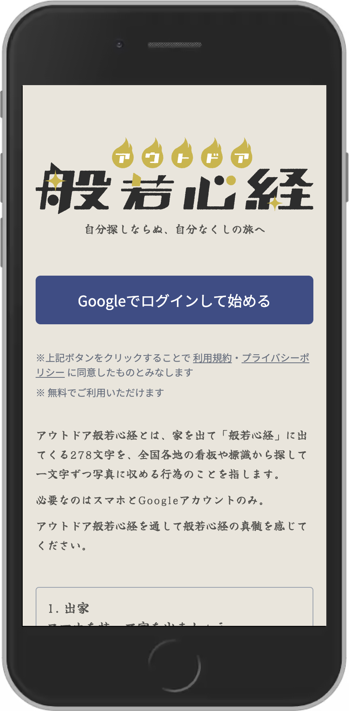
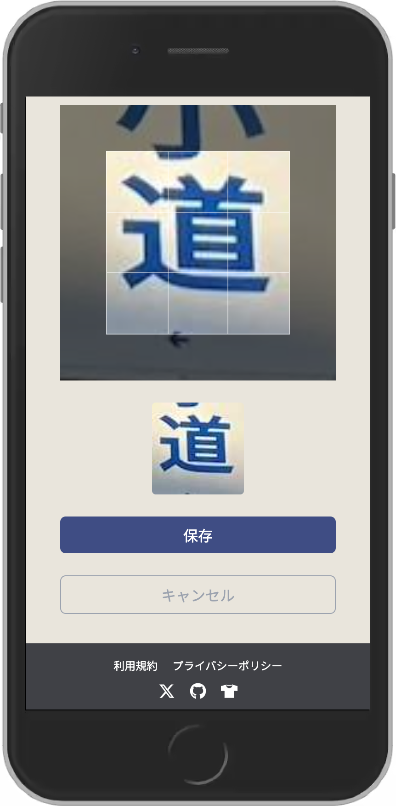
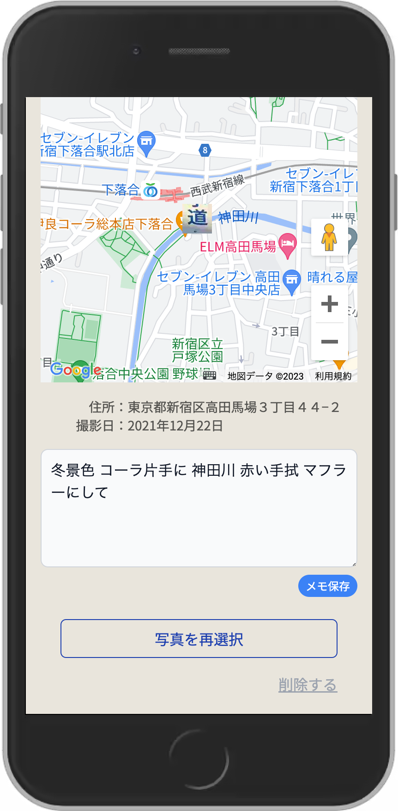

# アウトドア般若心経


## 概要

### アウトドア般若心経とは

[アウトドア般若心経](https://www.outdoor-heart-sutra.com)とは、イラストレーターの[みうらじゅん](http://miurajun.net/profile/profile.html)氏が提唱した「般若心経」の新しい写経方法です。

> みうらじゅんは「般若心経」278 文字を、家を出て（これを「出家」と称す）、経文の文字のある市街の看板等の文字を写真に撮り（これを「写経」と称す）、経文の完成を目指すことを「アウトドア般若心経」と定義した。
>
> 出典: [フリー百科事典『ウィキペディア（Wikipedia）』](https://ja.wikipedia.org/wiki/%E3%82%A2%E3%82%A6%E3%83%88%E3%83%89%E3%82%A2%E8%88%AC%E8%8B%A5%E5%BF%83%E7%B5%8C)

### サービス概要

アウトドア般若心経は、街の看板や標識から集めた般若心経 278 文字の写真の管理が面倒な問題を解決することができる、アウトドア般若心経ユーザー向けの写経（写真経）アプリです。

ユーザーは、般若心経に含まれる 278 文字を一文字ずつ写真に収め管理することができ、文字の収集状況を経文の並び順で視覚的に確認することができます。また撮影場所の位置情報、メモを記録する機能も備えています。

Google アカウントをお持ちの場合、無料でご利用いただけます。

## サービス URL

https://www.outdoor-heart-sutra.com

## 機能

### Google 認証ログイン

Google アカウントをお持ちの方はすぐに始めることができます。



### 般若心経の全文を一覧で管理

般若心経 278 文字の写経状況を一覧で確認することができます。


### 写真の登録

HEIC、JPEG、PNG 形式の写真を登録することができます。またカメラ付きのデバイスの場合は、写真を撮影しアップロードすることも可能です。





### メモの登録

メモは 最大 140 文字まで登録が可能です。



### 地図の確認

メニューから「地図」を選択すると、写経済みの全ての文字の位置情報を Google Maps 上で確認することができます。写真をクリックすると詳細ページに遷移できます。


### マイページ

出家日（サービスを開始した日）と写経済みの文字の総数を確認することができます。退会の手続きもこちらから行うことができます。


## 開発環境

### バックエンド

- [Ruby](https://www.ruby-lang.org/ja/) 3.2.1
- [Rails](https://rubyonrails.org/) 7.0.4.2(API Mode)

### フロントエンド

- [React](https://react.dev/) 18.2.0
- [Next.js](https://nextjs.org/) 13.4.6
- [TypeScript](https://www.typescriptlang.org/) 5.0.2
- [Tailwind CSS](https://tailwindcss.com/) 3.3.2

### 認証

- [NextAuth.js](https://next-auth.js.org/) 4.22.1

## リンター／フォーマッター

- [RuboCop](https://rubocop.org/) 1.55.1
- [ESLint](https://eslint.org/) 8.36.0
- [Prettier](https://prettier.io/) 2.8.4

### テスト

- バックエンド
  - [RSpec](https://rspec.info/)
- フロントエンド
  - [Jest](https://jestjs.io/ja/)
  - [React Testing Library](https://testing-library.com/)
  - [Playwright](https://playwright.dev/)

### データベース

- [PostgreSQL](https://www.postgresql.org/)

### インフラ

- バックエンド
  - [Fly.io](https://fly.io/)
- フロントエンド
  - [Vercel](https://vercel.com/)

### CI/CD

- [GitHub Actions](https://github.co.jp/features/actions)

### 外部サービス

- [Google Maps API](https://developers.google.com/maps?hl=ja)
- [Google GeoCoding API](https://developers.google.com/maps?hl=ja)
- [Amazon S3](https://aws.amazon.com/jp/s3/)

## 開発環境の構築手順

### バックエンド

```
$ git clone https://github.com/shirotamaki/outdoor-heart-sutra.git
$ cd outdoor-heart-sutra/backend
$ bin/setup
$ brew install vips
$ rails s
```

### フロントエンド

```
$ cd outdoor-heart-sutra/frontend
$ npm install
$ npm run dev
```

### 環境変数の設定

使用している環境変数になります。
|環境変数名|説明|
|---|---|
|GOOGLE_CLIENT_ID|Google 認証のクライアント ID|
|GOOGLE_CLIENT_SECRET|Google 認証のクライアントシークレット|
|RAILS_API_URL|Rails API（バックエンド）の URL をフルパスで指定する|
|NEXT_PUBLIC_RAILS_API_URL|Rails API（バックエンド）の URL をフルパスで指定する|
|NEXT_PUBLIC_GOOGLE_MAPS_API_KEY|Google Maps API キー|
|NEXT_PUBLIC_GEOCODING_API_KEY|Geocoding API キー|
|NEXT_SECRET|JWT を暗号化しトークンをハッシュ化するために使用する秘密鍵を指定する|
|NEXTAUTH_URL|Next.js アプリケーションのベース URL を指定する|
|NEXTAUTH_URL_INTERNAL|Next.js アプリケーションのベース URL を指定する|
|NEXT_PUBLIC_ANALYTICS_ID|Google Analytics 4 の測定 ID|
|USER_EMAIL|テスト用のユーザーのメールアドレス|
|USER_PASSWORD|テスト用のユーザーのパスワード|
|BASE_URL|Next.js アプリケーションのベース URL を指定する|

### 外部サービスの利用登録

Google サービスの利用にあたり、Google Cloud にて API とサービスの利用登録が必要となります。

- Geocoding API Key
- Google Maps API Key
- OAuth 2.0 クライアント ID

Amazon S3 サービスの利用登録が必要になります。

## Lint / Test

### バックエンド

Lint

```
$ bundle exec rubocop
```

Test

```
$ bundle exec rspec
```

### フロントエンド

Lint

```
$ npm run lint
$ npm run format
```

Unit Test

```
$ npm run test
```

E2E Test

```
$ npm run test:e2e
```
